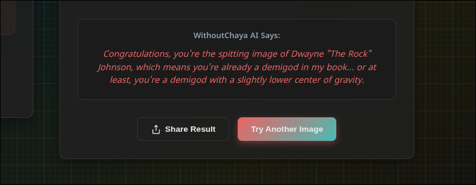

# Photo-COPY 🎯


## Basic Details
### Team Name: WithoutChaya


### Team Members
- Team Lead: S Murugan - NSS COLLEGE OF ENGINEERING PALAKKAD

### Project Description

Snap a selfie and let our app find your zany celebrity doppelganger from a wild database of famous faces—emotions and weird surprises guaranteed! Whether you get your lookalike or a totally unexpected match, it’s all about pointless fun and sharing laughs with friends. Everyone gets a twin—even if it makes no sense!

### The Problem (that doesn't exist)

We’re solving the age-old dilemma of not knowing which random celebrity (or object!) you sort of, kind of, barely resemble in the silliest way possible. Our app matches your selfie to a “doppelganger” for no reason at all—removing any actual sense of purpose, but adding heaps of laughter and absurdity to your day. Because the world clearly needed a pointless way to discover your totally useless twin!

### The Solution (that nobody asked for)

We’re tackling the world’s most pointless identity crisis with the power of AI and a database full of celebrity faces! Just upload your selfie, and our app launches into action—scanning pixels, making wild guesses, and matching you with your absurdly unexpected lookalike. It’s technical wizardry with zero real-world benefit, designed only to spark surprise, laughter, and maybe a little confusion. Because sometimes, you don’t need a real solution—just a really silly one!

## Technical Details
### Technologies/Components Used
For Software:
- Python, Javascript, HTML, CSS
- Flask
- face_recognition, numpy, groq, werkzeug
- [Tools used]

### Implementation
For Software:
 PhotoCOPY is an interactive full-stack web application designed to provide a uniquely entertaining and personalized user experience by merging advanced facial recognition with the creative power of generative AI. At its core, the application allows users to upload a selfie and discover their celebrity lookalike from a curated database of images. Built on a robust Python backend powered by the Flask framework, PhotoCOPY leverages the face_recognition library to perform a sophisticated analysis of facial features, ensuring a quick and accurate match for the user.
 The user journey is designed to be seamless and intuitive. The frontend, constructed with modern HTML5, CSS3, and Vanilla JavaScript, offers a responsive and dynamic interface where users can easily drag and drop or select an image file. Upon submission, the application provides real-time feedback with a loading animation while the backend processes the request. The server identifies the user's facial encoding, compares it against the pre-computed database of celebrity encodings, and pinpoints the closest match with remarkable efficiency.
 What truly sets PhotoCOPY apart is its innovative integration of a Large Language Model to enhance user engagement. After a doppelgänger is identified, the application makes a secure API call to the Groq Cloud, feeding context to the high-speed Llama3 model. In return, it receives a witty, sarcastic, and contextually relevant roast based on the user's celebrity match. This AI-generated content transforms the experience from a simple utility into a fun, shareable, and memorable interaction, demonstrating a practical and creative application of modern AI services within a web environment.
 Ultimately, PhotoCOPY stands as a comprehensive project that showcases the successful fusion of computer vision, full-stack web development, and third-party AI services. It represents a complete, deployable application with a clear architectural flow, from client-side interaction and backend logic to secure external API communication. The project not only highlights technical proficiency across multiple domains but also underscores the potential for creating compelling digital experiences by creatively combining different cutting-edge technologies.
---
# Installation

1. Clone the repository

```bash
    git clone https://github.com/murugnn/photo-copy.git
    cd photo-copy
```

# Run

2. Install the dependencies

```bash
    pip install -r requirements.txt
```

3. Scan the database folder

```bash
    python create_db.py
```

4. Run the flask server

```bash
    python app.py
```

The port will be available at http://localhost:5000

### Project Documentation
For Software:

# Screenshots (Add at least 3)

Backend logic


---
App UI


---
The output with an AI roast too..


---
# Diagrams


---
### Project Demo
# Video

[](https://drive.google.com/file/d/1Q4Ci7KkMuvL1UdKcpZPcQGooFSHt8ZDV/view?usp=sharing)


## Team Contributions
- S Murugan

---
Made with ❤️ at TinkerHub Useless Projects 


