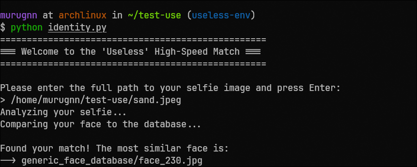
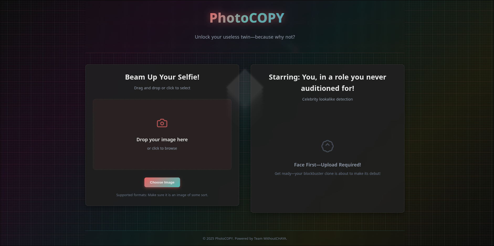
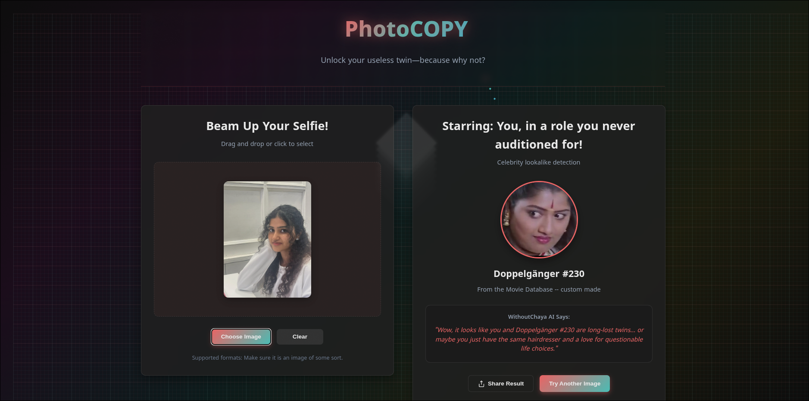
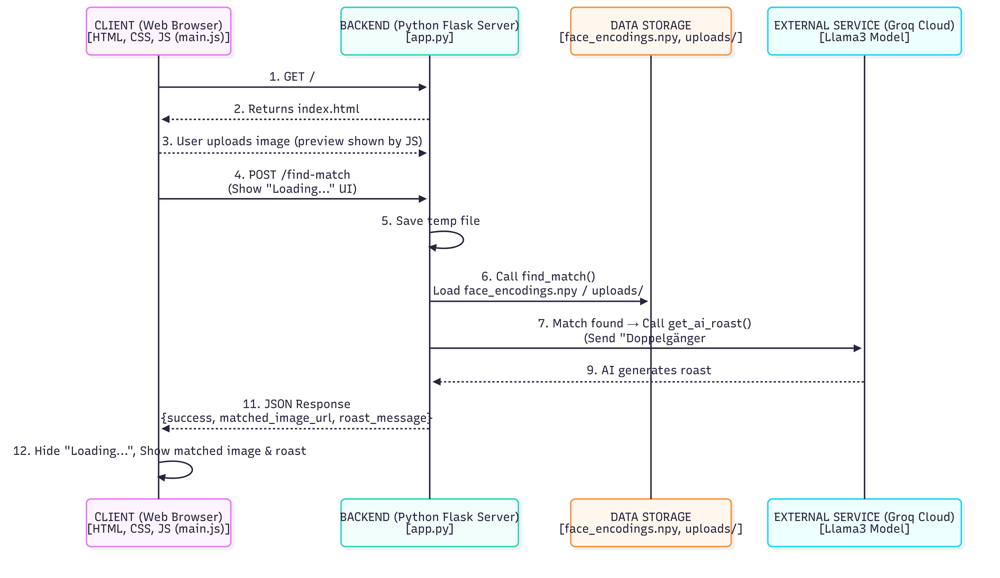

# Photo-COPY 🎯


## Basic Details
### Team Name: WithoutChaya


### Team Members
- Team Lead: S Murugan - NSS COLLEGE OF ENGINEERING PALAKKAD

### Project Description

Snap a selfie and let our app find your zany celebrity doppelganger from a wild database of famous faces—emotions and weird surprises guaranteed! Whether you get your lookalike or a totally unexpected match, it’s all about pointless fun and sharing laughs with friends. Everyone gets a twin—even if it makes no sense!

### The Problem (that doesn't exist)

We’re solving the age-old dilemma of not knowing which random celebrity (or object!) you sort of, kind of, barely resemble in the silliest way possible. Our app matches your selfie to a “doppelganger” for no reason at all—removing any actual sense of purpose, but adding heaps of laughter and absurdity to your day. Because the world clearly needed a pointless way to discover your totally useless twin!

### The Solution (that nobody asked for)

We’re tackling the world’s most pointless identity crisis with the power of AI and a database full of celebrity faces! Just upload your selfie, and our app launches into action—scanning pixels, making wild guesses, and matching you with your absurdly unexpected lookalike. It’s technical wizardry with zero real-world benefit, designed only to spark surprise, laughter, and maybe a little confusion. Because sometimes, you don’t need a real solution—just a really silly one!

## Technical Details
### Technologies/Components Used
For Software:
- Python, Javascript, HTML, CSS
- Flask
- face_recognition, numpy, groq, werkzeug
- [Tools used]

### Implementation
For Software:
# Installation

1. Clone the repository

```bash
    git clone https://github.com/murugnn/photo-copy.git
    cd photo-copy
```

# Run

2. Install the dependencies

```bash
    pip install -r requirements.txt
```

3. Scan the database folder

```bash
    python create_db.py
```

4. Run the flask server

```bash
    python app.py
```

The port will be available at http://localhost:5000

### Project Documentation
For Software:

# Screenshots (Add at least 3)

Backend logic



App UI





# Diagrams




### Project Demo
# Video
[Add your demo video link here]
*Explain what the video demonstrates*

## Team Contributions
- S Murugan

---
Made with ❤️ at TinkerHub Useless Projects 


